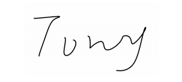
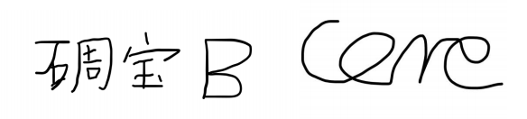

# 内部人员处置通知书-肖遥解说



## 问题出在何处？

1. 肖瑶解说（下文简称“肖遥”）多次违反《SRO 联合公约》中第 1 条“三个友好原则：不抄袭；不外 传；不制作”中的“不抄袭”原则。在原作者未授权的情况下违规“混剪”同站（指哔哩哔哩弹幕视 频网）的多个视频\[1\] 
2. 肖遥于 2019 年 11 月 03 日加入新坛\[2\]并担任管理员等要务，其运营范围与 SRO 冲突，违反 SRO 联合公约中第 23 条“不允许在组织非之情非同意的情况下建立第三方组织，重建服务器，加 入其他组织等一切创建或加入其他人的行为”

## 如何处罚？

1. 若继续留在组织，则需签订如下条约：不要夸大其词，也不要随意彰显自己，更不要去彰显自己没有 的东西，不要随意改变自己的动向，不要随意创立或加入其他组织，不要意气用事，尊重组织内外人 员，不要随意发表自己消极的观点
2. 若退出组织则遵守[ SRO分离协议 ](https://sromc.cn/lian-he-gong-yue#fen-li-xie-yi)，否则将依法告之
3. 列入重点监察对象，若再有违纪现象，则给予开除处分，加入[ SRO黑名单 ](https://sromc.cn/zu-zhi-hei-ming-dan/ren-yuan-hei-ming-dan)

## 签字

## 相关注释

\[1\] : 违规转载搬运的部分视频 _因大部分视频已经被删除，此处仅提供部分视频证据，其余为截图证据_ 

![&#x968F;&#x610F;&#x6DF7;&#x526A;&#x540C;&#x7AD9;&#x4ED6;&#x4EBA;&#x4F5C;&#x54C1;\[av67827502&#x3001;av67228749\]](../.gitbook/assets/tu-pian-2.png)

![&#x968F;&#x610F;&#x6DF7;&#x526A;&#x540C;&#x7AD9;&#x4ED6;&#x4EBA;&#x4F5C;&#x54C1;\[av67827502&#x3001;av67228749\]](../.gitbook/assets/tu-pian-3.png)

![&#x968F;&#x610F;&#x6DF7;&#x526A;&#x540C;&#x7AD9;&#x4ED6;&#x4EBA;&#x4F5C;&#x54C1;\[av67827502&#x3001;av67228749\]](../.gitbook/assets/tu-pian-4%20%281%29.png)

![&#x968F;&#x610F;&#x6DF7;&#x526A;&#x540C;&#x7AD9;&#x4ED6;&#x4EBA;&#x4F5C;&#x54C1;\[av67827502&#x3001;av67228749\]](../.gitbook/assets/tu-pian-4.png)

![&#x968F;&#x610F;&#x6DF7;&#x526A;Youtuber&#x53CA;Minecraft&#x5B98;&#x65B9;&#x4F5C;&#x54C1;\[av63506216\]](../.gitbook/assets/tu-pian-5.png)

